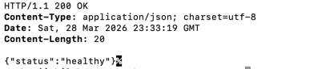
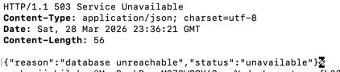
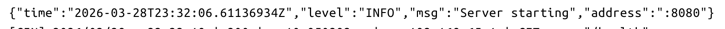
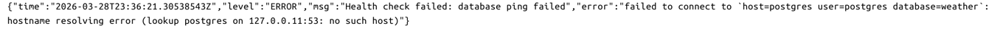
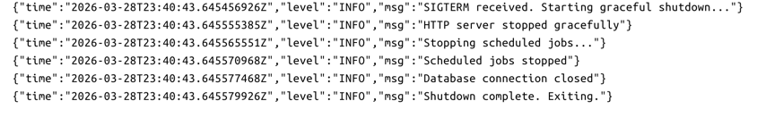

# Weather Forecast API - Лабораторна робота №1

## Налаштування змінних оточення

Застосунок зчитує всі налаштування зі змінних оточення (12-Factor App). Жодних захардкоджених паролів чи URL в коді.

| Змінна            | Опис                            | Приклад                    |
|-------------------|---------------------------------|----------------------------|
| `DB_HOST`         | Хост бази даних PostgreSQL      | `postgres` / `localhost`   |
| `DB_PORT`         | Порт бази даних                 | `5432`                     |
| `DB_USER`         | Користувач бази даних           | `postgres`                 |
| `DB_PASSWORD`     | Пароль бази даних               | `postgres`                 |
| `DB_NAME`         | Назва бази даних                | `weather`                  |
| `SERVER_HOST`     | Публічна URL-адреса сервера     | `http://localhost:8080/`   |
| `SERVER_PORT`     | Порт HTTP-сервера               | `8080`                     |
| `WEATHER_API_KEY` | API-ключ від weatherapi.com     | `your-api-key`             |
| `EMAIL_HOST`      | SMTP хост                       | `smtp.gmail.com`           |
| `EMAIL_PORT`      | SMTP порт                       | `587`                      |
| `EMAIL_USERNAME`  | Email-адреса для відправки      | `your-email@gmail.com`     |
| `EMAIL_PASSWORD`  | Пароль або app-specific ключ    | `your-app-password`        |

Створіть `.env` файл у корені проекту:

```env
DB_HOST=postgres
DB_PORT=5432
DB_USER=postgres
DB_PASSWORD=postgres
DB_NAME=weather
SERVER_HOST=http://localhost:8080/
SERVER_PORT=8080
WEATHER_API_KEY=your-api-key
EMAIL_HOST=smtp.gmail.com
EMAIL_PORT=587
EMAIL_USERNAME=your-email@gmail.com
EMAIL_PASSWORD=your-app-password
```

## Збірка та запуск

### Запуск через Docker Compose

```bash
docker-compose up --build
```

### Запуск тестів

```bash
go test ./... -v
```

## Автоматичне керування схемою БД (Міграції)

Застосунок використовує **golang-migrate** для автоматичного керування схемою бази даних. Під час запуску застосунок автоматично перевіряє та застосовує всі наявні міграції з директорії `migrations/`.

## Health Check (Глибока перевірка стану)

**Ендпоінт:** `GET /health`

Перевіряє з'єднання з базою даних через SQL ping.

- **200 OK** — застосунок працює, база даних доступна
- **503 Service Unavailable** — застосунок працює, але база даних недоступна

### Підтвердження Health Check

**БД підключена (200 OK):**

```bash
$ curl -i localhost:8080/health
```


**БД зупинена (503 Service Unavailable):**

```bash
$ curl -i localhost:8080/health
```



## Структуроване логування (JSON)

Застосунок використовує `log/slog` з `JSONHandler` для виводу всіх логів у форматі JSON в STDOUT.

**Обов'язкові поля:** `time` (timestamp), `level`, `msg` (message).

### Приклад логів при запуску

### Приклад логу помилки



## Graceful Shutdown (Плавне завершення роботи)

Застосунок обробляє сигнали `SIGTERM` та `SIGINT`.

**Очікувана поведінка при отриманні сигналу:**

1. Логується повідомлення `"SIGTERM received. Starting graceful shutdown..."`
2. HTTP-сервер завершує обробку поточних запитів (таймаут 30 секунд)
3. Зупиняються заплановані задачі (cron jobs)
4. Закриваються з'єднання з базою даних
5. Процес завершується з кодом `0`

### Підтвердження Graceful Shutdown


